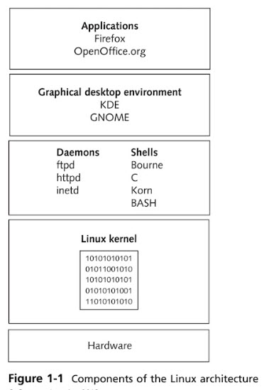

# linux-operations-and-administration

Textbook: Linux Operations and Administration by Alfred Basta

Ch 1: Intro to Linux Operations

* Linux architecture and its components: kernal, desktop environment, and file structure (pg.2)
* Open source software has its source code published with the software. Users can modify and redistribute open-source software (pg.2)
* Ubuntu is a distribution/version of Linux. Other distributions include red hat, openSUE, etc
* Linux is a modular system, meaning all components are separate from one another
* The **kernal** is the core of the operating system and manages the hardware such as disk drivers and memory
* **RAM** is short for random access memory and it is a temporary storage space where the computer reads and writes data. The memory is erased when the computer shuts down (pg.7-8)
* A **shell** is a command-line interface between users and the kernal. The most common shell is BASH (pg.10)

| Components of Linux Architecture (pg 7) -[image link](https://github.com/hsarfraz/linux-operations-and-administration/blob/main/images/linux_architecture.jpg) | 
| ------------- |
| Content Cell  | 
| Content Cell  |
| Content Cell  |
| Content Cell  |
| Content Cell  |

